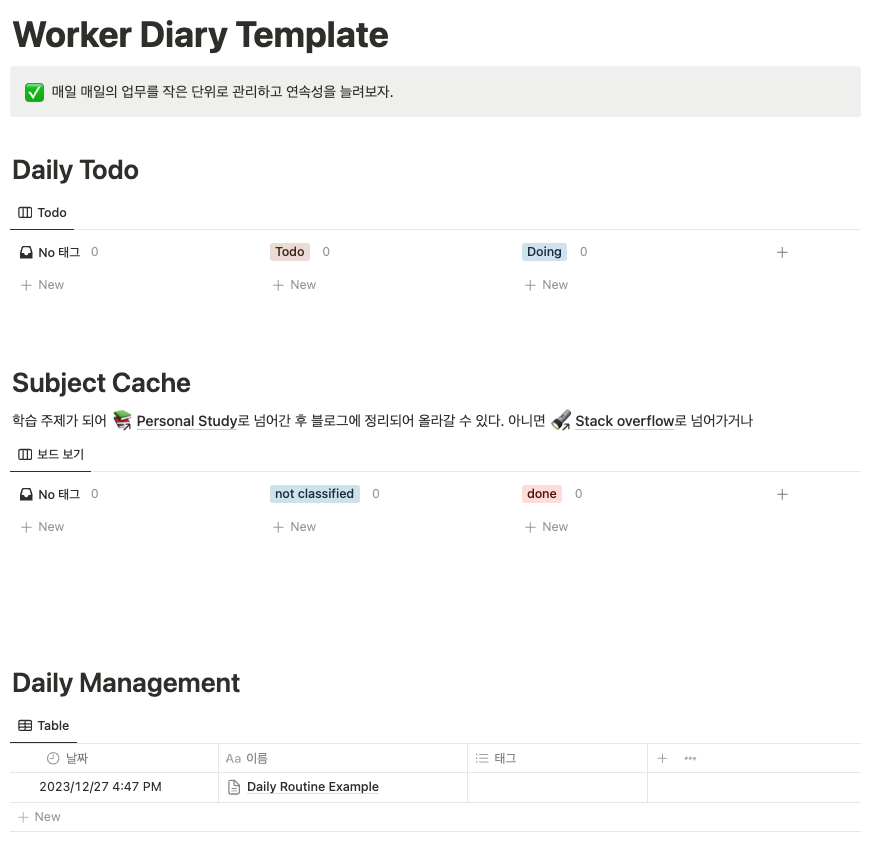

## 커리어

나의 역량이라는 것은 객관적으로 판단하기가 참 어려운 것 같다. 나의 역량을 증명해야 하는 상황이 오면 좀 답답함을 자주 느낀다. 가뜩이나 나는 나의 성과를 자신있게 내보이고 멋지게 꾸며내는 일에 서투른 사람이라서 더욱 그렇다. 내가 한 것은 다 별로인 것 같은 가면 증후군의 화신 같은 사람이랄까.. 물론 이런 성향은 또 반대로 나를 ‘겸손’하게 만들기 때문에 항상 더 성장하고 싶다는 생각을 하게 만드는 좋은 작용을 할 때도 있다.

아무튼 본인의 역량을 증명해야만 하는 상황을 나는 두 가지 정도 겪었다. 입사 지원(이직도 당연히 여기에 포함된다)을 하는 경우가 첫 번째이고, 다른 하나는 회사 내에서의 평가 상황이다. 물론 더 다양한 경우가 있겠지만, 나의 경우에는 이 두 가지였다. 특히 매번 평가 시즌에는 고통이 엄습했다. 연차가 쌓이기 전에는 심지어 내가 뭘 했던가를 제대로 떠올리기도 힘들었고, jira에 들어가서 내가 할당된 카드들을 마구마구 뒤져보는데 시간을 많이 썼다.

이런 어려움을 가끔 선배 개발자 분들에게 토로할 때가 있었는데 많은 분들이 수시로 이력서를 업데이트 해보는 것을 추천해주셨다. 감명만 받고 실천은 제대로 못하고 있다가 작년부터 하고 있는데, 실제로 도움이 많이 된다. 내가 했던 모든 일을 이력서에 전부 적을 수 없기 때문에 어떤 일이 더 나에게 중요한 일이었는지 우선 순위를 정하는 것에도 도움이 되었고, 그때 그때 수시로 작성하기 때문에 과거에 했던 일이 디테일하게 기억나지 않아서 고생하는 일도 없었다.

지금은 매일 매일 업무 기록을 개인 노션에 기록하고 → 기록이 어느 정도 쌓이면 이력서에 업데이트하는 방식을 사용하고 있다. 이에 관해서는 아래에 좀 더 자세히 적어보고자 한다.

## 노동자의 일기

나는 노션으로 매일 업무 기록을 간단하게 작성하려고 노력한다. 템플릿은 아래 이미지와 같다.

### Daily Todo

Daily Todo에는 해야 할 일을 적는다. 사실 당일에 반드시 해야 할 일이 아니더라도 적는다. 업무와 관련이 없는 일도 포함된다. Personal Todolist라고 생각하면 될 것 같다.

### Subject Cache

Subject Cache에는 일을 하면서 새롭게 알게된 것이나 더 공부해두면 좋을 것들을 키워드로 적어둔다. 추후에 해당 키워드에 관해서 학습을 하면 done으로 옮겨서 치우는 형태로 진행하게 된다. 사실 공부한 내용을 정리해서 블로그에 올리는 것 까지가 처음에 생각한 흐름인데… 블로그에 올리자니 글을 정리하는게 피로감이 느껴져서 거기까지는 잘 안했다……!

### Daily Management

Daily Management에 매일 문서를 하나씩 생성하여 그날 그날 한 업무를 적는다. 템플릿은 대충 아래와 같다.

1. Daily Assignment
    - 말 그대로 매일 해야 할 일들을 적어두는 곳이다. Daily Todo는 단발성이라면 여기에는 매일 하고자 마음먹은 것들을 적는다.
    - 방통대 강의 1개 듣기, 독서 30분, 운동 같은 것들을 보통 적어둔다.
    - 강의..들어야지..는 지금은 방학
2. Work
    - work에는 캘린더 체크와 3R, Retrospective가 있다.
    - 캘린더 체크는 말 그대로 그날의 일정을 체크하는 시간이다. 오늘부터 2주 후의 일정까지 체크해두고 회의 참석 여부 등 변경 사항에 대해서 반영한다.
3. 3R은 그냥 내가 억지로 만든 말인데..
    - 메일함에 쌓인 메일을 읽고(보통은 깃헙 알림밖에 없..)
    - 동료의 코드를 리뷰하고
    - 전날까지 했던 작업에 대한 기억을 되살리는 시간으로 쓴다.
    - 캘린더에 반복되는 일정으로 잡아뒀고, 일 시작하고 직후 30분간 실행한다. 코드 리뷰 시간에 따라 달라지기도 한다.
4. Retrospective 역시 반복되는 일정으로 매일 업무 종료 전 10분 정도 실행한다.
    - 그날 한 일, 동료와 있었던 일, 커뮤니케이션 등에 대해서 전체적으로 돌아보는 시간이다.

### 그래서 좋냐고

아무래도 내가 내 업무 환경, 템포에 맞춰서 만든 것이니 좋게 느껴진다. 적기 전보다 업무를 좀 더 짜임새 있게 하게 되는 경향이 있고, 업무 이외의 인생에도 좋은 영향을 주는 것 같다. ‘맞다 까스불!’ 같은 일이 좀 줄어든다고 해야하나.. 근데 ‘맞다 시프티!’는 아직도 종종 일어난다. 템플릿에 추가할까..

### 노션?

기록하는 것들을 조금 단순하게 바꿔서 옵시디언으로 갈아타볼까 하는 생각도 조금 있는데.. 아직은 생각만 하고 있다.
