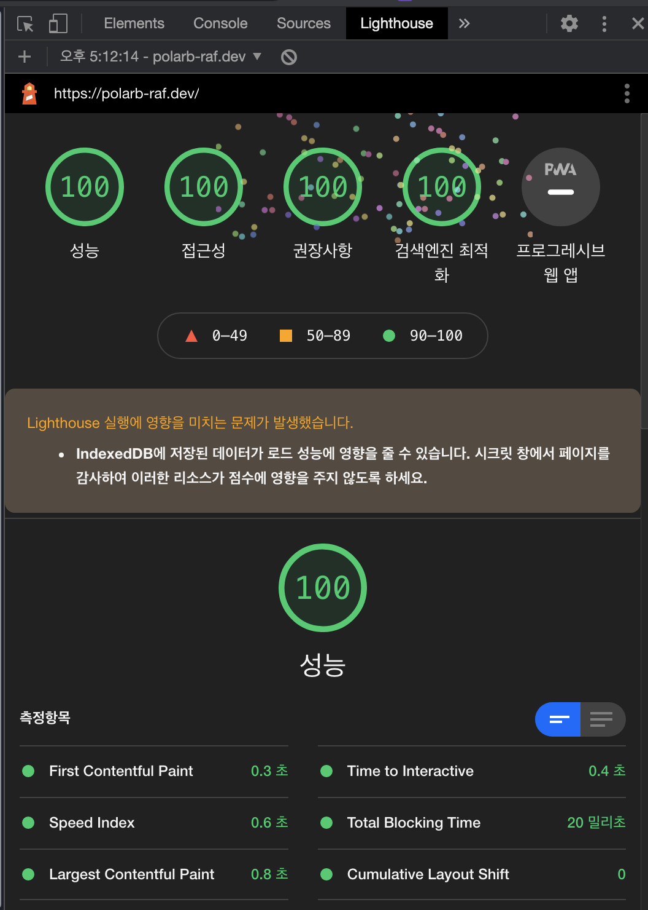
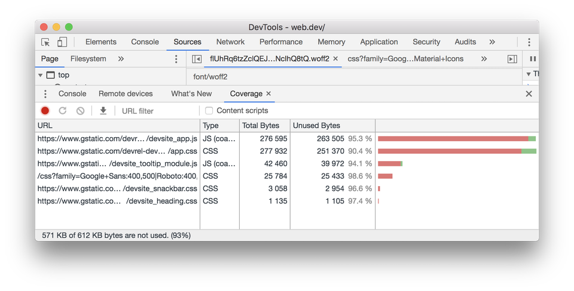

최근 회사에서 웹 퍼포먼스 향상을 목표로 작업을 했었습니다. 팀 내부에서도 이 주제에 관심이 높야져 Lighthouse를 주제로 스터디를 하게 되었습니다. 스터디를 준비하며 공부한 내용을 정리해봅니다.

## Lighthouse
Lighthouse는 웹 페이지 성능을 측정하기 위해 구글에서 만든 오픈소스 도구입니다. CLI로 동작할 수도 있고, 크롬 개발자도구에서 실행하는 것도 가능합니다. 상황에 따라 다르지만 저는 기본적으로 개발자도구에서 실행합니다.

Lighthouse에 대한 내용은 나중에 자세히 다룰 기회가 있을 거라고 생각합니다. 오늘은 단지 이 글의 주제가 어디서 왔는지 설명하는 것에서 그치려고 합니다.

Lighthouse를 실행하면 웹 페이지의 성능 측정 결과를 보여줍니다. 측정 결과는 성능, 접근성, 권장사항, 검색엔진 최적화, 프로그레시브 웹 앱의 다섯 가지 항목으로 나타납니다(한글 기준). 위 이미지는 이 블로그를 Lighthouse로 측정한 결과입니다(제가 잘한 것은 하나도 없고, 블로그 테마를 만드신 분이 잘 만드셨습니다 ㅎㅎ). 보시는 것처럼 First Contentful Paint 등의 항목으로 성능을 검사한 후에 추천(영어로는 Opportunites) 항목에 페이지 성능을 향상하기 위한 방법을 알려줍니다.

상세한 내용은 [https://web.dev/lighthouse-performance](https://web.dev/lighthouse-performance/)페이지의 Opportunities 항목에 잘 정리되어 있습니다. 오늘은 이 항목들 중 첫 번째인 Eliminate render-blocking resources에 대해 적어보려고 합니다. 저는 개인적인 공부를 위해 제게 필요한 내용 위주로 정리한 것이니 정확한 내용은 web.dev에서 직접 확인하시는 것을 추천합니다 :)

## Eliminate render blocking resources
Lighthouse는 웹 페이지의 first paint를 지연시키는 리소스(Render blocking Resources)를 알려줍니다. web.dev에서는 이 리스트를 확인하여 first paint와 관련된 리소스만 inlining하고 중요하지 않은 리소스는 연기하며, 사용되지 않는 리소스를 제거하는 방식으로 성능을 높이는 것을 추천하고 있습니다.

### Render blocking resources?
Lighthouse는 두 종류의 렌더링 차단 리소스를 찾습니다. script와 stylesheet입니다.

아래와 같은 `<script>`를 지정합니다.
- 문서의 head 안에 있는 것
- defer 속성이 없는 것
- async 속성이 없는 것

또한 아래와 같은 `<link rel="stylesheet">`를 지정합니다.
- disabled 속성이 없는 것. disabled 속성이 지정되어 있다면 브라우저는 그 파일을 다운로드하지 않습니다.
- 유저의 기기에 맞는 media 속성을 가지지 않은 것.

### 어떻게 필수적인 부분을 찾아낼 수 있을까
렌더 차단 리소스의 영향을 줄이기 위한 첫 번째 단계는 (스크립트와 스타일시트의) 어느 부분이 필수적이고(원문에서는 critical이라고 표현하고 있습니다), 어느 부분이 그렇지 않은지 구분하는 것입니다. 크롬 개발자도구의 Coverage tab을 사용하면 그 작업을 쉽게 할 수 있습니다. 더 자세한 내용은 [구글 크롬 릴리즈 노트](https://developers.google.com/web/updates/2017/04/devtools-release-notes#coverage)에서 확인하실 수 있습니다. 사용 예시 화면은 아래 이미지와 같습니다.

Coverage의 URL을 클릭하여 Source 탭에서 파일을 검사할 수 있습니다. 실제로 어느 부분이 사용되고, 어느 부분이 그렇지 않은지 소스 코드에 직접 표시를 해줍니다.

- 초록색으로 표시 된 부분: First paint에 필수적인 스타일 혹은 페이지의 핵심 기능에 관련된 코드
- 빨간색으로 표시 된 부분: 즉시 보이지 않는 컨텐츠에 적용되는 스타일 혹은 페이지의 핵심 기능에 사용되지 않는 코드

### Render-blocking scripts를 제거하는 방법
필수적인 코드를 확인했다면, 그 코드를 HTML 페이지 내부의 inline `script`태그에 넣으세요. 페이지를 불러올 때 페이지의 핵심 기능을 처리하는데 필요한 코드를 바로 사용할 수 있습니다.

만약 필수적이지 않은 Render-blocking URL이 있다면, 그것을 그대로 두고 `script`태그에 `async` 혹은 `defer`속성을 넣으세요.(이 [문서](https://developers.google.com/web/fundamentals/performance/critical-rendering-path/adding-interactivity-with-javascript)도 같이 보시면 좋습니다.)

전혀 사용되지 않는 코드라면 삭제해주세요.

### Render-blocking stylesheets를 제거하는 방법
`script`태그를 inline으로 넣는 것과 유사하게, first paint에 필수적인 스타일 요소들을 HTML의 `head`태그 내부에 `style`태그를 생성하고 거기에 넣으세요. 그리고 나머지 스타일 요소를 `link` 태그에 `preload`를 사용하여 비동기적으로 불러오세요.

Render-blocking style을 제거하는 다른 접근은 그 스타일들을 media query로 정리하여 서로 다른 파일로 나누는 것입니다. 그리고 각 stylesheet의 `link`태그에 `media` 속성을 넣어주세요. 페이지를 불러올 때, 브라우저는 사용자의 기기에 맞는 스타일시트만 먼저 적용합니다([Render-Blocking CSS](https://developers.google.com/web/fundamentals/performance/critical-rendering-path/render-blocking-css)도 같이 보세요).

마지막으로, CSS 파일을 Minify하여 용량을 줄이세요.

## 정리
지금까지 브라우저의 Render-blocking Resource를 줄이는 방법에 대해서 알아보았습니다. 처음 글을 작성하기 시작할 때의 생각과는 다르게, 거의 web.dev 페이지를 단순 번역한 문서에 가깝게 되었네요. `async`와 `defer`, `preload`, `media` 등의 속성은 다른 글로 설명하는 기회를 만들어 보겠습니다.

여기에서 언급하는 내용들은 정답이 아닙니다. 저도 사내 스터디를 위해 이 문서를 읽었지만, 정작 내부 서비스에 그대로 적용하기는 어려울 것 같습니다. 다만 Render blocking이 어떤 원리로 일어나는지 이해하고, blocking을 최소하하는 방법을 이해하여 각자의 상황에 맞게 적용하면 된다고 생각합니다.

이 스터디가 한동안 계속 이어질 것 같은데요, 최대한 다룬 주제들을 블로그에 옮겨보도록 노력하겠습니다.